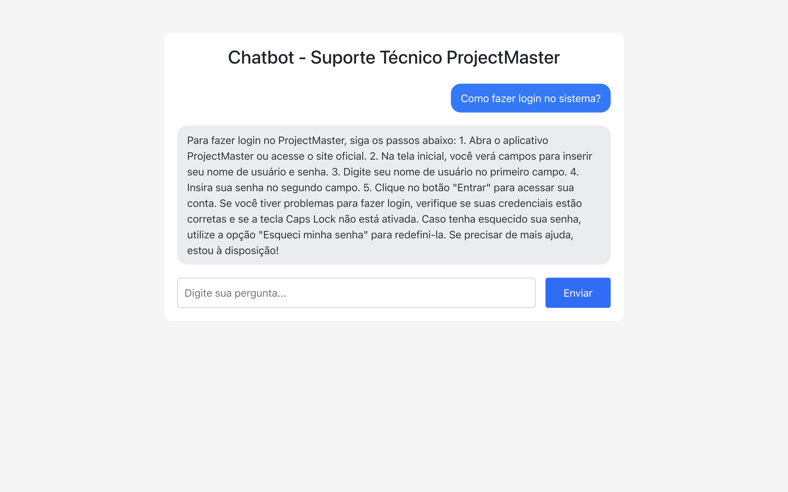
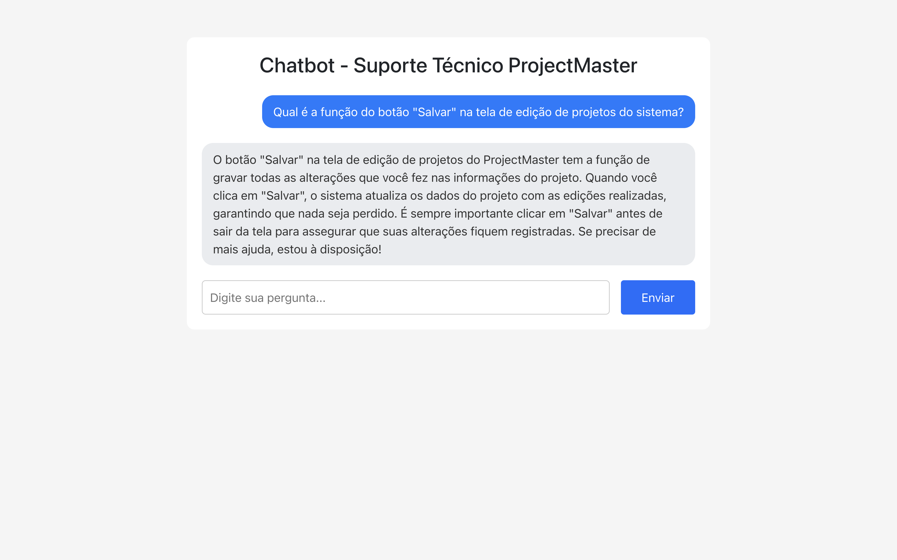
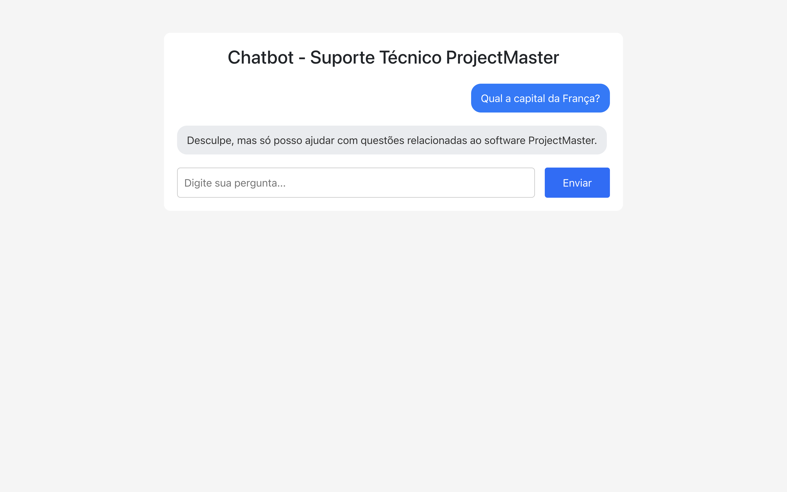

# Documento de apresentação de projeto
## Domínio Escolhido
	Suporte Técnico de uma empresa de software

## Justificativa da Escolha:
A escolha desse domínio se deu para ilustrar como o chatbot pode ser personalizado para um contexto de atendimento ao cliente, respondendo dúvidas técnicas sobre um produto de software específico (por exemplo, um software de gerenciamento de projetos chamado “ProjectMaster”). O chatbot deverá fornecer suporte técnico básico, auxiliar na resolução de problemas comuns, e manter a conversa dentro deste escopo.

---
## Modificações no Código
#### Prompt de Sistema:
```text
Você é um assistente de suporte técnico especializado no software ProjectMaster.
Responda de forma clara, simples e educada, ajudando o usuário a resolver problemas
ou entender funcionalidades do ProjectMaster. Não responda perguntas fora do contexto
de suporte técnico ao ProjectMaster.
```
Esse prompt instrui o chatbot a se comportar como um assistente de suporte técnico especializado no software ProjectMaster, fornecendo suporte técnico básico e mantendo a conversa dentro do escopo do software.

---
#### Lógica de Memória de Conversa:
A memória de conversa foi implementada usando o próprio módulo `session` do Flask. A memória começa armazenando o estado inicial da conversa, que é o estado `start`. A cada interação, o estado é atualizado para refletir a última ação do usuário. Isso permite que o chatbot mantenha o contexto da conversa e responda de acordo com o estado atual.

---
#### Limitação do Escopo:
Foram usados dois métodos para limitar o escopo do chatbot:
1. **Instruções Iniciais:** O prompt de sistema instrui o chatbot a responder apenas perguntas relacionadas ao suporte técnico do software ProjectMaster.
2. **Verificação de Palavras-Chave:** O chatbot verifica se a pergunta do usuário contém palavras-chave relacionadas ao software ProjectMaster. Se a pergunta não contiver essas palavras-chave, o chatbot responde com uma mensagem informando que só pode responder perguntas relacionadas ao software.

Dessa maneira, conseguimos ter mais garantia de que o usuário não sairá do escopo do chatbot e o use para o propósito correto. 

---
## Testes e Resultados
### Perguntas de Teste Utilizadas:
#### 1. Como fazer login no sistema?
**Resposta obtida:**
```text
Para fazer login no ProjectMaster, siga os passos abaixo: 1. Abra o aplicativo ProjectMaster ou acesse o site oficial. 2. Na tela inicial, você verá campos para inserir seu nome de usuário e senha. 3. Digite seu nome de usuário no primeiro campo. 4. Insira sua senha no segundo campo. 5. Clique no botão "Entrar" para acessar sua conta. Se você tiver problemas para fazer login, verifique se suas credenciais estão corretas e se a tecla Caps Lock não está ativada. Caso tenha esquecido sua senha, utilize a opção "Esqueci minha senha" para redefini-la. Se precisar de mais ajuda, estou à disposição!
```
**Análise da Resposta:**
A resposta foi adequada, fornecendo instruções claras e detalhadas sobre como fazer login no sistema ProjectMaster.

#### 2. Qual é a função do botão "Salvar" na tela de edição de projetos do sistema?
**Resposta obtida:**
```text
O botão "Salvar" na tela de edição de projetos do ProjectMaster tem a função de gravar todas as alterações que você fez nas informações do projeto. Quando você clica em "Salvar", o sistema atualiza os dados do projeto com as edições realizadas, garantindo que nada seja perdido. É sempre importante clicar em "Salvar" antes de sair da tela para assegurar que suas alterações fiquem registradas. Se precisar de mais ajuda, estou à disposição!
```
**Análise da Resposta:**
A resposta foi adequada, explicando claramente a função do botão "Salvar" na tela de edição de projetos do sistema ProjectMaster.

#### 3. Qual é a capital da França?
**Resposta obtida:**
```text
Desculpe, mas só posso ajudar com questões relacionadas ao software ProjectMaster.
```
**Análise da Resposta:**
O chatbot não respondeu à pergunta, pois está limitado a fornecer suporte técnico sobre o software ProjectMaster.
---
## Prints da Interface (Screenshots)
### Pergunta 1

### Pergunta 2

### Pergunta 3


## Conclusão
#### O que funcionou bem:
- A lógica de memória de conversa foi eficaz para manter o contexto da conversa.
- O chatbot respondeu adequadamente às perguntas relacionadas ao software ProjectMaster.
- A limitação do escopo foi eficaz para manter o chatbot dentro do contexto de suporte técnico do software.
- As instruções iniciais ajudaram a orientar o usuário sobre o propósito do chatbot.
#### O que poderia ser melhorado:
- Adicionar mais respostas para perguntas comuns de suporte técnico.
- Melhorar a detecção de palavras-chave para identificar perguntas relacionadas ao software ProjectMaster.
- Implementar um sistema de feedback para avaliar a qualidade das respostas do chatbot.
- Adicionar mais interações e funcionalidades para tornar o chatbot mais interativo e útil.